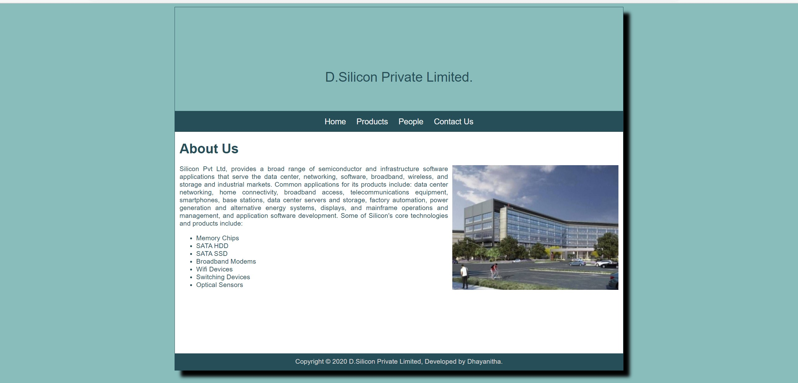
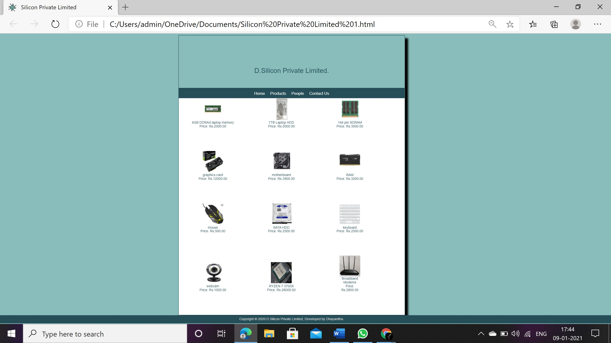
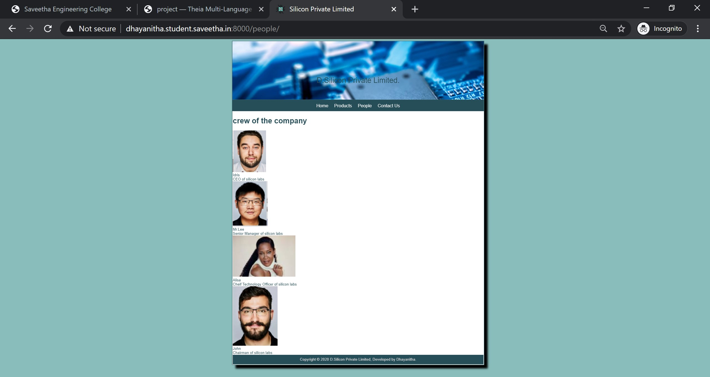
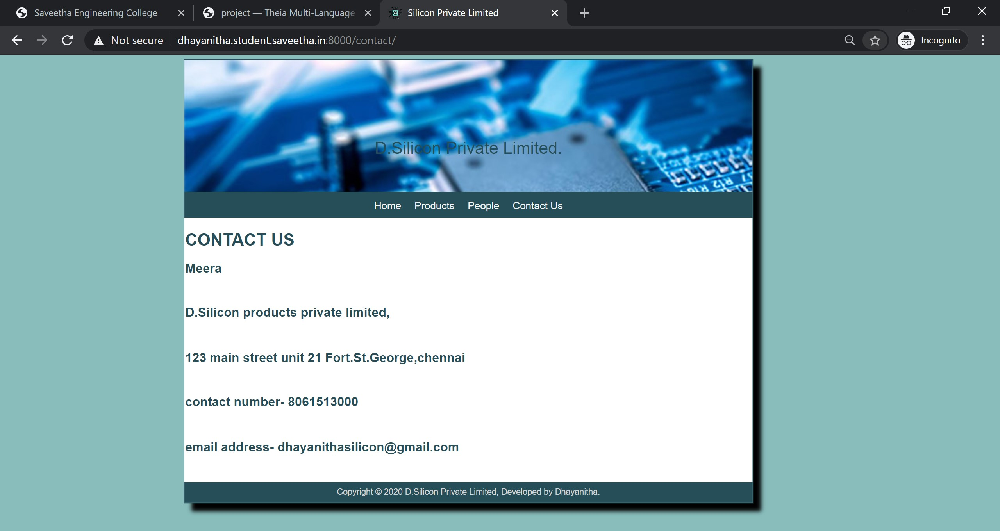
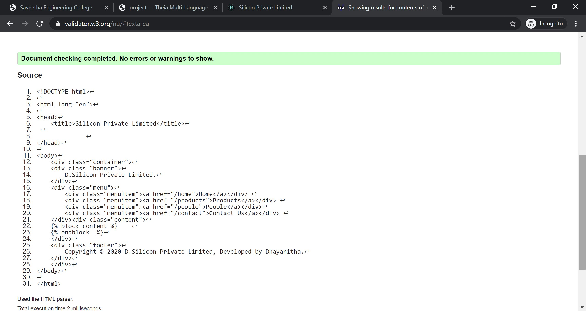
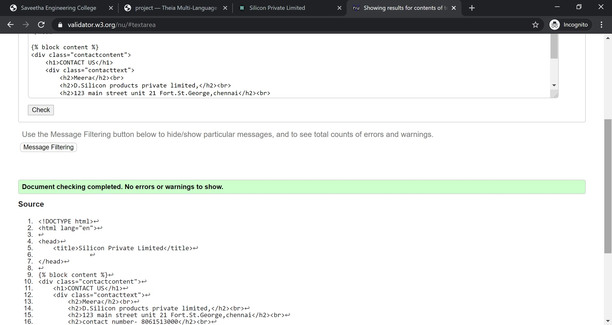
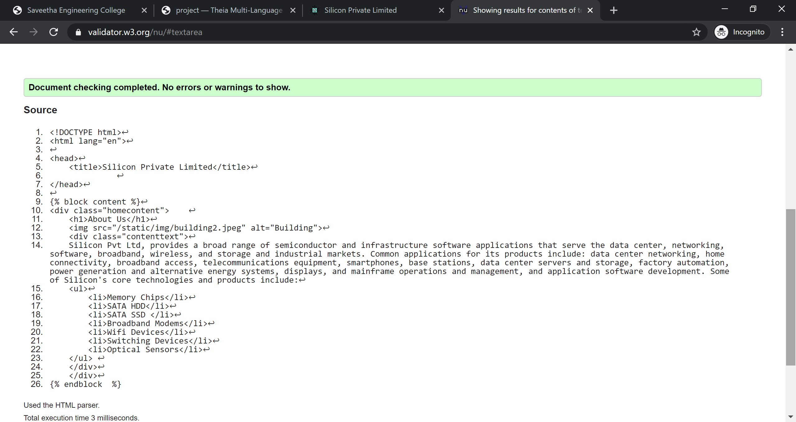
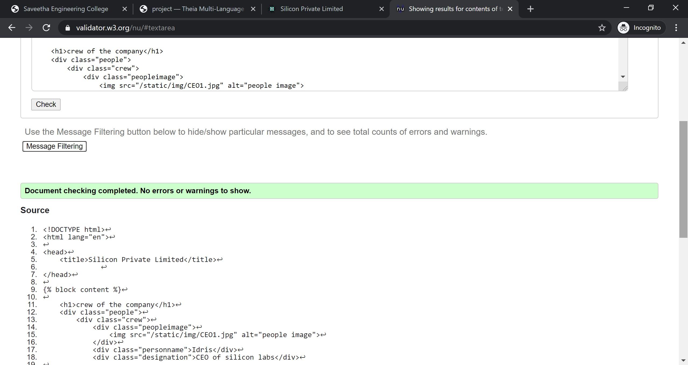
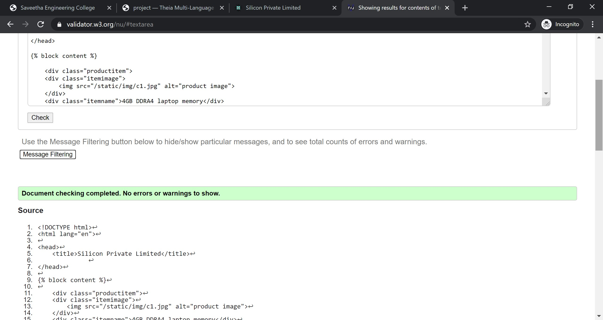

# Web Design for a Manufacturing Company
## AIM: 
To design a static website for a chip manufacturing company.

## DESIGN STEPS:
### Step 1: 
Requirement collection.
### Step 2:
Creating the layout using HTML and CSS.
### Step 3:
Updating the sample content.
### Step 4:
Choose the appropriate style and color scheme.
### Step 5:
Validate the layout in various browsers.
### Step 6:
Validate the HTML code.
### Step 6:
Publish the website in the given URL.

## PROGRAM:

### base.html
```

<!DOCTYPE html>
<html lang="en">

<head>
    <title>Silicon Private Limited</title>
    <link rel="stylesheet" href="">
    <link rel = "icon" href ="" type = "image/x-icon"> 
              
</head>

<body>
    <div class="container">
    <div class="banner">
        D.Silicon Private Limited.
    </div>
    <div class="menu">
        <div class="menuitem"><a href="/home">Home</a></div> 
        <div class="menuitem"><a href="/products">Products</a></div> 
        <div class="menuitem"><a href="/people">People</a></div>
        <div class="menuitem"><a href="/contact">Contact Us</a></div> 
    </div><div class="content">
        
    
    </div>
    <div class="footer">
        Copyright © 2020 D.Silicon Private Limited, Developed by Dhayanitha.
    </div>
    </div>
</body>

</html>
```

### home.html
```



    <div class="homecontent">    
    <h1>About Us</h1>
    
    <div class="contenttext">
    Silicon Pvt Ltd, provides a broad range of semiconductor and infrastructure software applications. Some of Silicon's core technologies and products include:
    <ul>
        <li>Memory Chips</li>
        <li>SATA HDD</li>
        <li>SATA SSD </li>
        <li>Broadband Modems</li>
        <li>Wifi Devices</li>
        <li>Switching Devices</li>
        <li>Optical Sensors</li>
    </ul> 
    </div>
    </div>

```
### products.html
```



<div class="productitem">
    <div class="itemimage">
        
    </div>
    <div class="itemname">4GB DDRA4 laptop memory</div>
    <div class="itemprice">Price: Rs.2000.00 </div>
</div>
<div class="productitem">
    <div class="itemimage">
        
    </div>
    <div class="itemname">1TB Laptop HDD</div>
    <div class="itemprice">Price: Rs.5000.00 </div>
</div>
<div class="productitem">
    <div class="itemimage">
        
    </div>
    <div class="itemname">144 pin SDRAM</div>
    <div class="itemprice">Price: Rs.3500.00 </div>
</div>
<div class="productitem">
    <div class="itemimage">
        
    </div>
    <div class="itemname">graphics card</div>
    <div class="itemprice">Price: Rs.12000.00 </div>
</div>
<div class="productitem">
    <div class="itemimage">
        
    </div>
    <div class="itemname">motherboard</div>
    <div class="itemprice">Price: Rs.3900.00 </div>
</div>
<div class="productitem">
    <div class="itemimage">
        
    </div>
    <div class="itemname">RAM</div>
    <div class="itemprice">Price: Rs.3200.00 </div>
</div>
<div class="productitem">
    <div class="itemimage">
        
    </div>
    <div class="itemname">mouse</div>
    <div class="itemprice">Price: Rs.500.00 </div>
</div>
<div class="productitem">
    <div class="itemimage">
        
    </div>
    <div class="itemname">SATA HDD</div>
    <div class="itemprice">Price: Rs.2500.00 </div>
</div>
<div class="productitem">
    <div class="itemimage">
        
    </div>
    <div class="itemname">keyboard</div>
    <div class="itemprice">Price: Rs.2500.00 </div>
</div>
<div class="productitem">
    <div class="itemimage">
        
    </div>
    <div class="itemname">webcam</div>
    <div class="itemprice">Price: Rs.1000.00 </div>
</div>
<div class="productitem">
    <div class="itemimage">
        
    </div>
    <div class="itemname">RYZEN 7 3700X</div>
    <div class="itemprice">Price: Rs.28000.00 </div>
</div>
<div class="productitem">
    <div class="itemimage">
        
        <div class="itemname">Broadband Modems</div>
        <div class="itemprice">Price: Rs.2800.00 </div>
    </div>

</div>
</div>

```
###people.html
```



<div class="peoplecontent">
    <h1>crew of the company</h1>
    <div class="people">
        <div class="crew">
            <div class="peopleimage">
                
            </div>
            <div class="personname">Idris</div>
            <div class="designation">CEO of silicon labs</div>

        </div>
         <div class="crew">
            <div class="peopleimage">
                
            </div>
            <div class="personname">Mr.Lee</div>
            <div class="designation">Senior Manager of silicon labs</div>

        </div>
         <div class="crew">
            <div class="peopleimage">
                
            </div>
            <div class="personname">Alisa</div>
            <div class="designation">Cheif Technology Officer of silicon labs</div>

        </div>
         <div class="crew">
            <div class="peopleimage">
                
            </div>
            <div class="personname">John</div>
            <div class="designation"> Chairman of silicon labs</div>

        </div>
    </div>
    

```
###contact.html
```



<div class="contactcontent">
    <h1>CONTACT US</h1>
    <div class="contacttext">
        <h2>Meera</h2><br>
        <h2>D.Silicon products private limited,</h2><br>
        <h2>123 main street unit 21 Fort.St.George,chennai</h2><br>
        <h2>contact number- 8061513000</h2><br>
        <h2>email address- dhayanithasilicon@gmail.com</h2>
    </div>
</div>


```
## OUTPUT:








## CODE VALIDATION REPORT:










## RESULT:
Thus a website is designed for the chip manufacturing company and is hosted in the URL http://dhayanitha.student.saveetha.in:8000/. HTML code is validated.